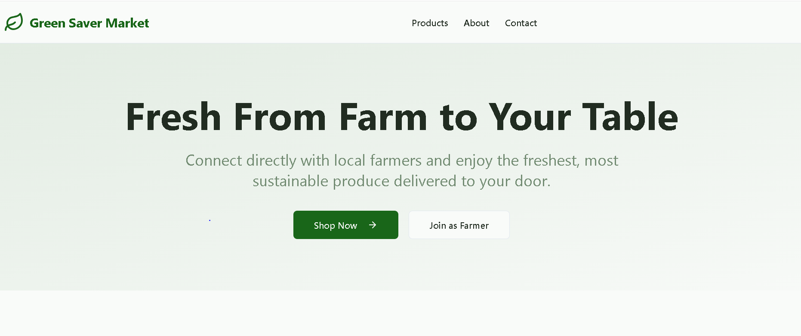

# Green Saver Market

> **Green Saver Market** is an organic produce and sustainable products marketplace built with the MERN stack (MongoDB, Express, React, Node.js). It offers customers fresh, organic products with a user-friendly interface and efficient backend APIs, featuring authentication via Clerk, UI components with Radix UI primitives, and robust input sanitization.

## 🚀 Project Description

Green Saver Market is a full-stack e-commerce web application dedicated to selling fresh, organic, and eco-friendly products. It connects farmers directly with consumers aiming to promote health and environmental sustainability. The project includes:

- Product catalog with filtering and search
- User authentication and authorization (Clerk)
- Admin dashboard for product and order management
- Farmer dashboard
- Customer dashboard
- Real-time communication via Socket.io
- Secure and sanitized API backend
- Responsive and accessible UI built with React and Radix UI Toast components
- Dedicated dashboards tailored for farmers and customers for personalized experiences

## 📦 Features

- **Browse Products:** Search, filter by category, and view product details.
- **User Auth:** Register, login, and manage user sessions securely with Clerk.
- **Admin Controls:** Add, edit, and remove products; manage orders.
- **Farmer Dashboard:** Manage products, track orders and sales, view productivity analytics.
- **Customer Dashboard:** Browse products, track orders, manage profile and payments.
- **Toast Notifications:** User feedback and alerts with customizable toasts.
- **API:** RESTful backend endpoints secured with input validation and sanitization.
- **Performance & Security:** Utilizes Helmet, express-mongo-sanitize, rate limiting.
- **Responsive UI:** Mobile-friendly design with Tailwind CSS.

# 🏢 Dashboards
## i) Admin Dashboard
The Admin Dashboard empowers administrators to efficiently manage the platform and maintain smooth operations. Key features include:

Full management of products: add, update, delete

Order management and tracking

User management and role assignment

Analytics and reporting on sales and usage

Access control and security settings

## ii) Farmer Dashboard
The Farmer Dashboard provides farmers with tools to manage their produce and business effectively. Key features include:

Manage and update farm products and inventories

View and track customer orders and payment status

Productivity and sales analytics

Access to farm resources and training content

Receive alerts and notifications on orders and farm conditions

## iii) Customer Dashboard
The Customer Dashboard offers users a personalized shopping experience. Key features include:

Browse, search, and favorite products

Track order history and live delivery status

Manage personal profile and payment methods

Notifications about deals, orders, and tips for sustainability


## 🛠️ Setup Instructions

### Prerequisites

- Node.js (v18+ recommended)
- npm or pnpm/yarn
- MongoDB database (local or remote)
- Clerk account for authentication (get your publishable key)

### Backend Setup

1. **Clone the repository**

   ```bash
   git clone https://github.com/yourusername/green-saver-market.git
   cd green-saver-market/server
   ```

2. **Install dependencies**

   ```bash
   npm install
   # or
   pnpm install
   ```

3. **Configure environment variables**

   Create a `.env` file based on `.env.example` with values for:

   ```
   PORT=4000
   MONGODB_URI=your_mongodb_connection_string
   CLERK_PUBLISHABLE_KEY=your_clerk_publishable_key
   FRONTEND_URL=http://localhost:3000
   NODE_ENV=development
   ```

   > **Important:** Ensure no trailing newline characters or spaces in URLs or keys.

4. **Start the backend server**

   ```bash
   npm run dev
   ```

   Backend API will run on [http://localhost:4000](http://localhost:4000).

### Frontend Setup

1. **Navigate to client folder**

   ```bash
   cd ../client
   ```

2. **Install dependencies**

   ```bash
   npm install
   # or
   pnpm install
   ```

3. **Configure environment variables**

   Copy `.env.example` to `.env` and add your API base URL and Clerk frontend keys:

   ```
   VITE_API_URL=http://localhost:4000/api/v1
   VITE_CLERK_PUBLISHABLE_KEY=your_clerk_publishable_key
   ```

4. **Start development server**

   ```bash
   npm run dev
   ```

   The app will be available at [http://localhost:3000](http://localhost:3000).

## 🌐 Deployed Application

- **Live app URL:** https://green-saver-market.vercel.app/  
  

## 🎥 Video Demonstration

A walkthrough video demonstrating key features of the project:  

coming soon.....

## 📸 Screenshots

### Homepage / Hero Section



### Featured Products Section

*

### Product Details Page

*

### Farmer Dashboard

*

### Customer Dashboard

*

### Toast Notifications in Action

*

## 🧰 Technologies Used

- Backend: Node.js, Express, MongoDB, Mongoose
- Frontend: React, Vite, Tailwind CSS, Radix UI
- Authentication: Clerk (with Clerk React & Clerk Express)
- Communication: Socket.io
- Security: Helmet, express-mongo-sanitize, express-validator
- State Management: React Context (where applicable)
- API Testing: Postman / curl

## 🙌 Contributing

Contributions and feedback are welcome! Please open issues and pull requests on GitHub.

## 📄 License

MIT License © 2025 Green Saver Market

## 📫 Contact

For questions or feedback, reach out at oumatedy@gmail.com 
